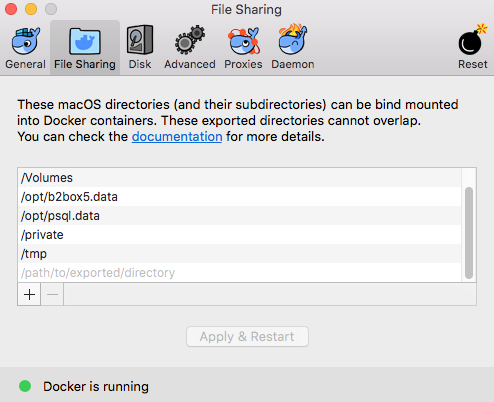

# Platform 6 install

> [Platform 6](https://documentation.amalto.com/platform6/master/) install scripts

## Requirements

You need to install [Docker](https://www.docker.com/) on your machine: 
- OSX: https://docs.docker.com/docker-for-mac/
- Windows: https://docs.docker.com/docker-for-windows/
- Linux: https://docs.docker.com/engine/installation/

⚠️ Please download only the stable channel! We recommend using the following version of Docker: 
- OSX: `18.03.1-ce-mac65`
- Windows: `18.03.1-ce-win65`

Configure Docker to use at least 2 CPUs, 4 GiB of memory and 1 GiB of swap.
You'll find in the __Getting Started__ how to update your settings: 
- OSX: https://docs.docker.com/docker-for-mac/#memory.
- Windows: https://docs.docker.com/docker-for-windows/#advanced

The network ports required are:
- `5005`: used by the Java debug port.
- `5432`: used internally between the Docker containers for PGSQL access.
- `5900`: used for the messages transactions through the Platform 6 bus.
- `8080`: used by the Platform 6 proxy (proxy.amalto.io) to have access on the Platform 6 instance.
- `8483`: used by the Platform 6 proxy (proxy.amalto.io) and allow to access the Amalto local Portal.
- `8545`: used by the [Parity](https://www.parity.io/) client.

## Instructions

### Step 1

Once Docker is running, clone the Git repository into a new directory dedicated to your local instance.

```
git clone git@github.com:amalto/platform6-install.git my-instance
cd my-instance
```

### Step 2

In the `provision_platform6.sh`/`provision_platform6.bat` file (from the root of your directory), set the variable `INSTANCE_ID` with the Platform 6 instance's name given by Amalto.

### Step 3

__OSX/Linux__

Create a directory `/opt` in your root (`/`) partition if you don't already have one.

> ⚠️  Be sure that your user is the owner of the directory and not the user `root`.

__OSX/Linux/Windows__

Run the script `provision_platform6.sh`/`provision_platform6.bat`.

It will clear the existing Platform 6 containers and volumes, before pulling the data needed for the initialisation of your instance.

> :alarm_clock: This step is normally performed once.

### Step 4

__OSX__

Share the folders `/opt/b2box5.data` and `/opt/psql.data` with Docker using the __File Sharing__ tab in the Docker settings menu.



__Windows__

Share the local drive `C` with Docker using the __Shared Drives__ tab in the Docker settings menu.


### Step 5

Run the script `start_platform6.sh`/`start_platform6.bat`.

It will start the Platform 6 container.
Run the script `logs_platform6.sh`/`logs_platform6.bat` to see the logs of the instance.

To stop your Platform 6 instance, run the script `force_stop_platform6.sh`/`force_stop_platform6.bat`.

Once your instance is up and running, you can access the Portal on [https://Your-MacBook-Pro.local:8483](https://Your-MacBook-Pro.local:8483) by replacing `Your-MacBook-Pro` with your hostname and using your internal dev portal credentials.

## Update your instance's version

In case you receive a notification from Amalto for a new release of Platform 6, you are advised to upgrade the version of your Platform 6 instance.

For that, check that your instance is stopped, then go to the file `start.yaml` and update the version of the image pulled by the `platform6` container.

__Example__:

Say you want the version `5.15.5`, the configuration of the `platform6` container should start with the following:

```yaml
platform6:
    container_name: platform6
    image: amalto/platform6:5.15.5
```