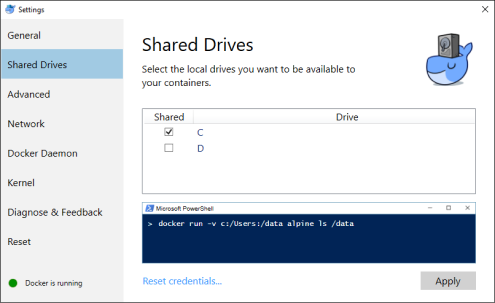

# EARLY ADOPTER PROGRAM

> Before running installation scripts you need to signup to our [Early Adopter Program](https://www.platform6.io/early-adopter-pgm-signup/).
> Once accepted in the program, you will be given an instance id that would allow you to proceed with the installation and use [Platform 6](https://www.platform6.io/).

# Platform 6 install

> [Platform 6](https://documentation.amalto.com/platform6/master/) install scripts

## Requirements

You need to install [Docker](https://www.docker.com/) on your machine: 
- OSX: https://docs.docker.com/docker-for-mac/
- Windows: https://docs.docker.com/docker-for-windows/ (only Windows Pro is supported!)
- Linux: https://docs.docker.com/engine/installation/

⚠️ Please download only the stable channel! We recommend using the following version of Docker: 
- OSX: `18.03.1-ce-mac65`
- Windows: `18.03.1-ce-win65`

Configure Docker to use at least 2 CPUs, 4 GiB of memory and 1 GiB of swap.
You'll find in the __Getting Started__ how to update your settings: 
- OSX: https://docs.docker.com/docker-for-mac/#memory.
- Windows: https://docs.docker.com/docker-for-windows/#advanced

The network ports used are:
- `2222`: used for SFTP.
- `5005`: used by the Java debug port.
- `5432`: used internally between the Docker containers for PGSQL access.
- `5900`: used for the messages transactions through the Platform 6 bus.
- `8080`: used by the Platform 6 proxy (proxy.amalto.io) to have access on the Platform 6 instance.
- `8480`: used by the Platform 6 proxy (proxy.amalto.io) and allow to access the Amalto local Portal.

In production, __only__ the following ports are __required__ to be open on the host machine: 2222 and 8080. All other ports should be closed and only used within Docker.

## Docker Containers

The current installation of Platform 6 relies on [Docker Compose](https://docs.docker.com/compose/install/) to launch the following containers on a single host machine:
- _pgsql_: The database container used by P6 Core.
- _p6core_: The Platform 6 Core container where P6 applications run.
- _p6proxy_: This container is only required if you want to run the Platform 6 Portal locally. _You can safely delete it in production._
- _demobc_: A local Ethereum blockchain node used by the Demo App. _You can safely delete it in production._
- _demoexplorer_: A web UI to monitor the Demo blockchain. _You can safely delete it in production._

## Instructions

### Step 1

Once Docker is running, clone the Git repository into a new directory dedicated to your local instance.

```
git clone git@github.com:amalto/platform6-install.git my-instance
cd my-instance
```

### Step 2

Rename the `.env.sample` file to `.env` and set the variable `INSTANCE_ID` with the Platform 6 instance's name given by Amalto.

__Windows__

Also, set the variable `PLATFORM6_ROOT` to the path where you wish to install your instance.

### Step 3

Run the script `provision_platform6.sh`/`provision_platform6.bat`.

It will clear the existing Platform 6 containers and volumes for your instance if any, before pulling the data needed for the initialisation of your instance.
When you run this script for the first time, it will try to delete a previous installation and throw errors because it cannot find any, therefore you can __safely ignore these errors__.

> ⏰ This step is normally performed once.

__OSX/Linux__

By default, it creates a folder called _platform6/instances_ in your _home_ directory (if not already present), where it creates another folder called after your instance id. This is where all your instance data resides. Hence, you can install multiple Platform 6 instances on the same physical machine.

However, you cannot run them at the same time, unless you modify port mapping in the [`docker-compose.yaml`](docker-compose.yaml) for some of your instances to avoid having multiple instances compete for the same port on the physical machine.

### Step 4

__Windows__

Share the local drive `C` with Docker using the __Shared Drives__ tab in the Docker settings menu.



### Step 5

Run the script `start_platform6.sh`/`start_platform6.bat`.

It will start the Platform 6 container.
Run the script `logs_platform6.sh`/`logs_platform6.bat` to see the logs of the instance.

To stop your Platform 6 instance, run the script `stop_platform6.sh`/`stop_platform6.bat`.

Once your instance is up and running, you can access the [Portal](http://localhost:8480/#/) with the credentials given by platform6.io.

## Update your instance's version

In case you receive a notification from Amalto for a new release of Platform 6, you are advised to upgrade the version of your Platform 6 instance.

For that, check that your instance is stopped, then go to the file `docker-compose.yaml` and update the version of the image pulled by the `platform6` container.

__Example__:

Say you want the version `5.15.5`, the configuration of the `platform6` container should start with the following:

```yaml
p6core:
    container_name: p6core
    image: amalto/platform6:5.15.5
```

## Update your database version

The database version is specified in the `.env` file. If you would like to change it follow these steps:

* First, export all your database data by running `pgsql_export.sh` (Unix) / `pgsql_export.bat` (Windows), while your database is still running with the old version. This will create a dump file in the `database_dumps` folder.
* Stop your instance by running `stop_platform6.sh` (Unix) / `stop_platform6.bat` (Windows).
* Set the variable `PGSQL_VERSION` in the `.env` file to the desired version, minimum version is 9.6.1.
* Run `pgsql_import.sh` (Unix) / `pgsql_import.bat` (Windows).
* Start your instance by running `start_platform6.sh` (Unix) / `start_platform6.bat` (Windows).

## Troubleshooting

__Windows__

Whenever Docker is a pain to mount your volumes on Windows, check this [very useful link](https://stackoverflow.com/questions/45972812/are-you-trying-to-mount-a-directory-onto-a-file-or-vice-versa), especially the answer that starts with _If you are using Docker for Windows..._
